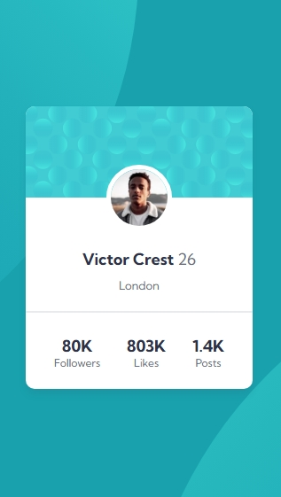

# Profile card component solution

This is a solution to the [Profile card component challenge on Frontend Mentor](https://www.frontendmentor.io/challenges/profile-card-component-cfArpWshJ). Frontend Mentor challenges help you improve your coding skills by building realistic projects. 

## Table of Contents
- [Overview](#overview)
- [Screenshots](#screenshots)
- [Links](#links)
- [Built with](#built-with)
- [Author](#author)

# Overview

# Screenshots

Destop Design

 

Mobile Design

# Links

- Repository Url -
- Live Url - 

# Built with

- Semantic HTML5 markup
- Custom CSS properties

# Author

- Name: shees
- Frontend-Mentor: [@shees360](https://www.frontendmentor.io/profile/shees360)